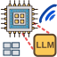

#  I Know What You Said: Unveiling Hardware Cache Side-Channels in Local Large Language Model Inference

Published at USENIX Security 2025 (link to [paper](https://cassuto.github.io/LLM-cache-side-channel-attack/static/pdfs/sec25cycle2-final1379.pdf)). Artifact available on [Zenodo](https://doi.org/10.5281/zenodo.15610475)

---
**Link to the webpage:** https://cassuto.github.io/LLM-cache-side-channel-attack/

### BibTeX
To cite our paper, please use:

```bibtex
@inproceedings{gao2025ikwys,
  author       = {Gao, Zibo and Hu, Junjie and Guo, Feng and Zhang, Yixin and Han, Yinglong and Liu, Siyuan and Li, Haiyang and Lv, Zhiqiang},
  title        = {I Know What You Said: Unveiling Hardware Cache Side-Channels in Local Large Language Model Inference},
  publisher    = {USENIX Association},
  booktitle    = {Proceedings of the 34th USENIX Conference on Security Symposium},
  year         = {2025},
  series       = {SEC '25},
  address      = {USA},
  location     = {Seattle, WA, USA},
}
```